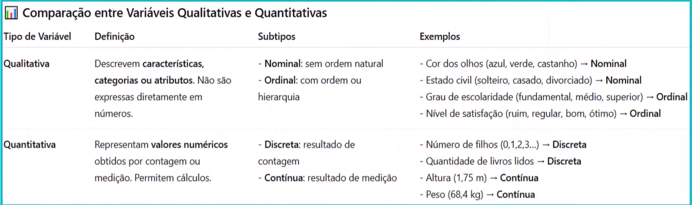

# INTRODUCTION TO DATA ANALYSIS

## 1. FOCUS

- Overview of the Domain (or Strategic Outlook of the Field)
- Definition of Analytical Typologies and Practical Illustrations
  - Descriptive Analysis
  - Exploratory Analysis
  - Explanatory Analysis
  - Predictive Analysis
  - Prescriptive Analysis
- Essential Competencies for Professional Advancement in this Field

## 2. GOING DEEP...

| Part | Description                                                                    |
|:----:|--------------------------------------------------------------------------------|
|  01  | [Data Analytics Overview](./topics/01-overview.md)                             |
|  02  | [Descriptive Analytics](./topics/02-descriptive_analytics.md)                  |
|  03  | [Diagnostic Analytics](./topics/03-diagnostic_analytics.md)                    |
|  04  | [Exploratory Data Analysis - EDA](./topics/04-exploratory_data_analysis.md)    |
|  05  | [Predictive Analytics](./topics/05-predictive_analytics.md)                    |
|  06  | [Prescriptive Analytics](./topics/06-prescriptive_analytics.md)                |
|  07  | [Variables - Quantitative vs Qualitative](topics/07-types_of_variables.md)     |
|  08  | [Knowledge consolidation - assessment](./topics/08-knowledge_consolidation.md) |

## 3. COMPARISON BETWEEN ANALYSIS TYPES

| ANALYTICS TYPE | QUESTION ANSWERED  | COMPLEXITY | TOOLS                | AVERAGE ROI             | IMPLEMENTATION TIMEFRAME |
|:--------------:|--------------------|:----------:|----------------------|-------------------------|--------------------------|
|  Descriptive   | What happened?     |    Low     | Excel, Power BI, GA4 | 15-20% efficiency gain  | 1-4 weeks                |
|   Diagnostic   | Why did it happen? |   Medium   | Python, R, Tableau   | 10-30% cost reduction   | 1-3 months               |
|   Predictive   | What will happen?  |    High    | ML, Python, Azure ML | 10-15% revenue increase | 3-6 months               |
|  Prescriptive  | What should we do? | Very High  | AI, Optimisation     | 15-30% cost reduction   | 6-12 months              |

## 4. TYPES OF VARIABLES

## 5. SUMMARY

