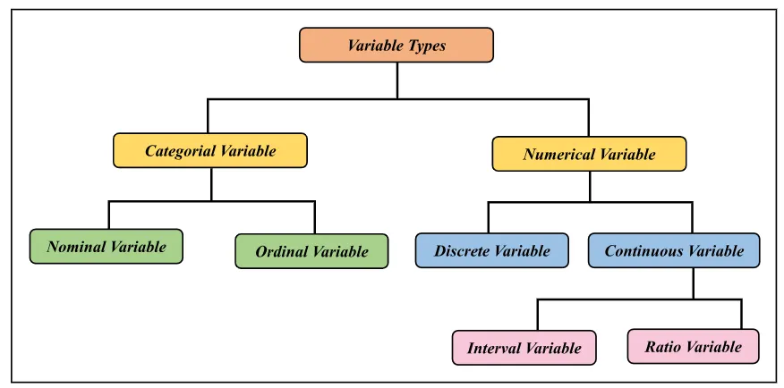

# VARIABLES FOR DATA ANALYTICS

## 1. TYPES OF VARIABLES



### 1.1. QUALITATIVE VARIABLES

Representam características, categorias ou atributos que não podem ser expressos diretamente em números
Servem para classificar os indíviduos ou objetos em grupos

#### 1.1.1. CLASSIFICAÇÃO

|   Tipo   | Descrição               | Uso                                     | Exemplos                                 |
|:--------:|-------------------------|-----------------------------------------|------------------------------------------|
| Nominais | não têm ordem natural   | Frequência, contagem, gráfico de barras | Cor dos olhos, Sim/Não, Estado civil     |
| Ordinais | têm ordem ou hierarquia | Gráfico de barras, mantendo ordem       | Nível de satisfação (ruim, regular, bom) |

#### 1.1.2. EXEMPLO - PÚBLICO PARTICIPANTE DE UMA PESQUISA

Pergunta: Qual a sua idade (em anos)?
-> Separado em Categorias ou Faixa Etária

| Faixa Etária | Grupo       |
|--------------|-------------|
| 01 a 13      | Criança     |
| 14 a 18      | Adolescente |
| Maior que 18 | Adulto      |

----

### 1.2. QUANTITATIVE VARIABLES

Representam valores numéricos, que podem ser medidos ou contados
Permitem cálculos matemáticos

#### 1.2.1. CLASSIFICAÇÃO

| Tipo      | Discretas                                         | Contínuas                                             |
|-----------|---------------------------------------------------|-------------------------------------------------------|
| Descrição | resultam de contagem, geralmente números inteiros | resultam de medições (qualquer valor do intervalo)    |
| Uso       |                                                   | Gráfico de barras, linhas, dispersão                  |
| Exemplos  | Quantidade de livros lidos no mês                 | Altura (1,75 m), peso (68,4 kg), temperatura (36,6ºC) |

#### 1.2.2. GRÁFICOS

| Tipo de Gráfico                | Descrição                                               | Exemplo                                                  |
|--------------------------------|---------------------------------------------------------|----------------------------------------------------------|
| Histograma                     | Distribuição de dados em intervalos                     | Distribuição de idades dos alunos em um curso            |
| Gráfico de barras (ou colunas) | Comparar quantidades entre categorias                   | Quantidade de livros lidos por diferentes grupos etários |
| Gráfico de linhas              | Mostrar tendências ao longo do tempo (séries temporais) | Evolução mensal das vendas em reais                      |

## 2. CASOS DE USO

Na prática, muitas pesquisas começam com um `questionário qualitativo exploratório` para entender percepções, opiniões e sentimentos
A partir das respostas, conseguimos transformar os temas mais citados em `variáveis mensuráveis` e construir um `questionário quantitativo
estruturado`

### 2.1. EXEMPLO - SATISFAÇÃO COM UM CURSO ONLINE

#### 2.1.1. QUESTIONÁRIO QUALITATIVO (EXPLORATÓRIO)

| -- | Pergunta                                                | Possível resposta                           |
|:--:|---------------------------------------------------------|---------------------------------------------|
| 01 | O que mais você gostou no curso?                        | Professores, material, flexibilidade, preço |
| 02 | O que menos você gostou no curso?                       |                                             |
| 03 | Quais dificuldades você encontrou durante as aulas?     |                                             |
| 04 | Como você avalia o suporte oferecido pela equipe?       |                                             |
| 05 | O curso atendeu suas expectativas? Por quê?             |                                             |
| 06 | O que poderia ser melhorado?                            |                                             |
| 07 | Você recomendaria o curso para outras pessoas? Por quê? |                                             |

#### 2.1.2. TRANSFORMAÇÃO EM QUESTIONÁRIO QUANTITATIVO

(1) Pergunta 01 poderia ser transformada para: 
```plaintext
Qual desses aspectos você mais gostou no curso? (Escolha até 2)

1. Professor(a)
2. Material didático
3. Flexibilidade de horários
4. Preço
```

(2) Pergunta 07 poderia ser transformada para (Net Promoter Score - NPS):
```plaintext
De 0 a 10, qual a probabilidade de você recomendar o curso para outras pessoas?
```

## 3. BIBLIOGRAPHICAL REFERENCES

- [01] [Variables For Data Analytics](https://medium.com/@remallirohan/variables-for-data-analytics-47355af17360)
- [02] [Tipos de Variáveis: Conceitos e Exemplos](https://blog.fastformat.co/estatistica-basica-tipos-de-variaveis/)
- [03] [Variáveis Quantitativas e Qualitativas: o que são e como analisar?](https://analisemacro.com.br/econometria-e-machine-learning/variaveis-quantitativas-e-qualitativas-o-que-sao-e-como-analisar/)