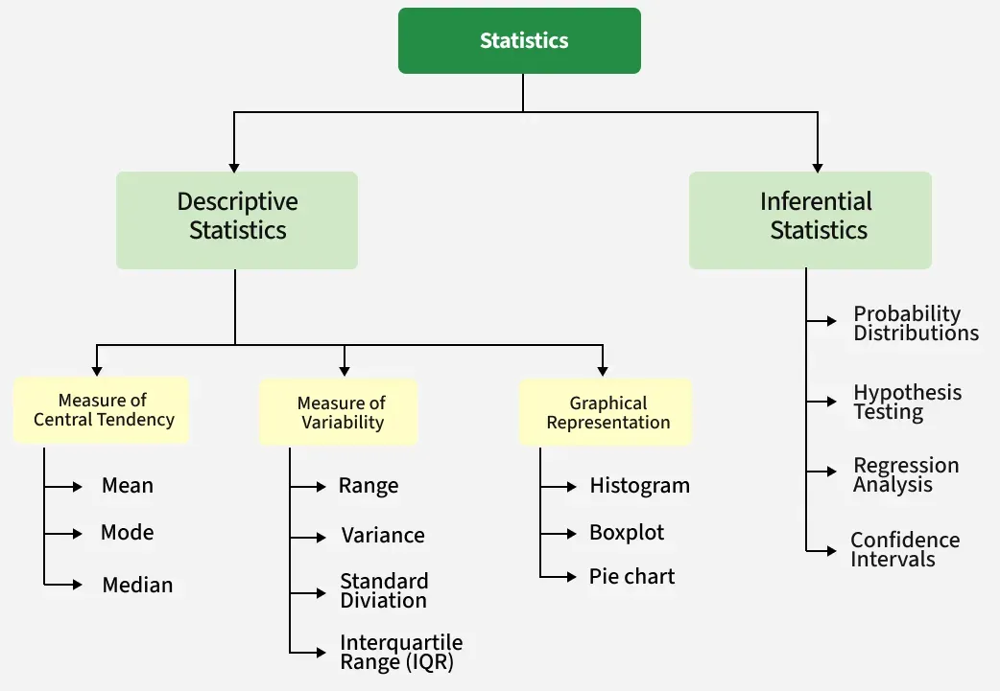

# STATISTICS

## 1. CLASSES

| Part | Sheets / Excel    |
|:----:|-------------------|
|  01  |  |
|  02  |               |

## .

## . BIBLIOGRAPHICAL REFERENCES

- [01] [Estatística Básica](https://www.ufrgs.br/probabilidade-estatistica/extra/material/apostila_de_estatistica_basica.pdf)
- [02] [Statistics Basics](https://www.statisticshowto.com/statistics-basics/)
- [03] [Introduction to Statistics](https://www.geeksforgeeks.org/maths/introduction-to-statistics/)
- [0] [Excel](https://support.microsoft.com/pt-BR/excel)